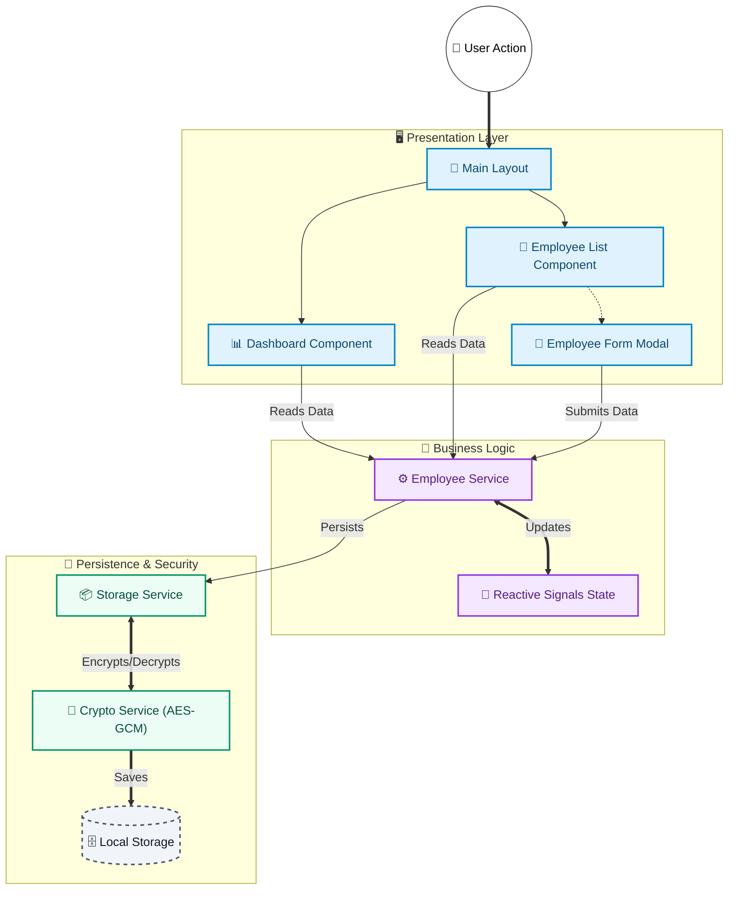

# Employee Management System

> **Enterprise-Grade Workforce Administration Platform**
> 
> *Precision-engineered for performance, security, and scalability.*

[](https://angular.io/)
[](https://www.typescriptlang.org/)
[](https://vitejs.dev/)
[]()
[]()
[](https://employee-dashboard-ivory.vercel.app/)

---

## 🏛️ Executive Summary

The **Employee Management System** is a sophisticated Single Page Application (SPA) architected to deliver a seamless workforce management experience. Built upon the robust **Angular** framework and powered by **Vite**, it represents a shift from legacy administration tools to a modern, reactive, and visually immersive interface.

The system prioritizes **Data Integrity** and **Security**, utilizing banking-grade encryption standards for client-side data persistence, ensuring that sensitive organizational data remains protected at rest.

### 🌟 Key Differentiators
-   **Reactive Core**: Leverages Angular **Signals** for fine-grained reactivity, eliminating unnecessary change detection cycles.
-   **Zero-Knowledge Persistence**: Implements **AES-GCM 256-bit encryption** for storage using the Web Crypto API.
-   **Glassmorphism UI**: A custom-designed aesthetic that combines blurred backdrops with high-contrast typography for a premium feel.
-   **Lazy Loaded Modules**: Optimized bundle sizes via route-level code splitting.

---

## 🏗️ System Architecture

The application follows a strict **Feature-Based Modular Architecture**. This design pattern ensures separation of concerns, maintainability, and scalability.



---

## 📂 Codebase Structure

The project directory is organized to facilitate scalability and team collaboration.

```plaintext
src/
├── app/
│   ├── core/                 # 🧠 SINGLETONS & BUSINESS LOGIC
│   │   ├── models/           #    - Data interfaces & Enums (Strict Typing)
│   │   ├── services/         #    - EmployeeService, StorageService, CryptoService
│   │   └── validators/       #    - Custom form validators (Regex patterns)
│   │
│   ├── features/             # 📦 SMART COMPONENTS (Lazy Loaded)
│   │   ├── dashboard/        #    - KPI visualization & Analyitcs
│   │   ├── employee-list/    #    - Grids, Filtering Logic, CSV Export
│   │   └── employee-form/    #    - Forms & Validation Logic
│   │
│   ├── layout/               # 📐 UI SKELETON
│   │   ├── main-layout/      #    - Wrapper for RouterOutlet
│   │   ├── sidebar/          #    - Navigation logic
│   │   └── header/           #    - Global search & User profile
│   │
│   ├── shared/               # 🧩 REUSABLE UI
│   │   ├── components/       #    - Generic UI (Modal, Badge, Loader)
│   │   └── pipes/            #    - Data transformers
│   │
│   ├── app.routes.ts         # 🛣️ Routing Logic (Lazy Loading Config)
│   └── app.config.ts         # ⚡ DI Configuration (Providers)
│
├── assets/                   # 🎨 STATIC RESOURCES (Images, Icons)
├── styles/                   # 💅 GLOBAL STYLING (SCSS Variables, Mixins)
└── index.html                # 🌐 Entry Point
```

---

## 🔐 Security & Encryption

We adhere to a **Security-First** approach.

### 🛡️ AES-GCM 256-bit Encryption
We utilize the **Web Crypto API** to implement **AES-GCM (Galois/Counter Mode)**, the gold standard for authenticated encryption.
-   **Authenticated Encryption:** Guarantees both confidentiality (data is hidden) and integrity (data hasn't been tampered with).
-   **Unique Keys:** Encryption keys are derived using **PBKDF2** with **100,000 iterations**, combining a secret, the user agent, and a unique salt per browser instance.
-   **Random IVs:** Every single encryption operation uses a fresh, random Initialization Vector (IV), preventing pattern analysis.

### 💾 Secure LocalStorage
Data persistence is handled by a custom `StorageService` that wraps the browser's LocalStorage with an encryption layer.
-   **Zero-Knowledge Storage:** Data saved to `localStorage` is **fully ciphertext**.
-   **Automatic Decryption:** The application transparently decrypts data on retrieval, providing a seamless user experience without compromising security.

---

## 📸 Visual Showcase

Experience the dual-themed interface designed for clarity and aesthetics.

### 📊 Dashboard Overview
The command center of the application. Visualizes key workforce metrics with real-time stats and smooth animations.

| **Dark Mode** | **Light Mode** |
|:---:|:---:|
|  |  |

### 👥 Global Workforce List
A powerful, high-density data table with advanced filtering and search capabilities.

| **Dark Mode** | **Light Mode** |
|:---:|:---:|
|  |  |

### ⚡ Seamless Actions
Intuitive modals and forms for managing employee data without losing context.

| **Add Employee** | **Edit Details** | **Delete Confirmation** |
|:---:|:---:|:---:|
|  |  |  |

> *All interactions feature glassmorphism backdrops and micro-interactions for a premium feel.*

---

## 🚀 Getting Started

### Prerequisites
-   **Node.js**: v18.0.0+
-   **npm**: v10.0.0+

### Installation & Execution

1.  **Clone the Architecture**
    ```bash
    git clone https://github.com/MehtabRosul/Employee-Dashboard.git
    cd Employee-Dashboard
    ```

2.  **Hydrate Dependencies**
    ```bash
    npm install
    ```

3.  **Launch Development Server**
    ```bash
    npm run start
    ```
    *Access the application at `http://localhost:4200/`*

4.  **Production Build**
    ```bash
    npm run build
    ```
    *Compiles optimized, minified assets to `dist/`.*

---

## 🧪 Quality Assurance

We maintain code quality through rigorous testing.

```bash
# Execute Unit Tests (Vitest)
npm run test
```

---

## 🤝 Contribution Guidelines

We welcome contributions from the engineering community.
1.  Fork the repository.
2.  Create a feature branch (`git checkout -b feature/ScaleArchitecture`).
3.  Commit your changes (`git commit -m 'feat: implement horizontal scaling'`).
4.  Push to the branch.
5.  Open a Pull Request.

---

## 📄 License & Proprietary Rights

**© 2026 Employee Management System.**
All rights reserved. This software is proprietary and confidential. Unauthorized copying, distribution, or modification is strictly prohibited.
