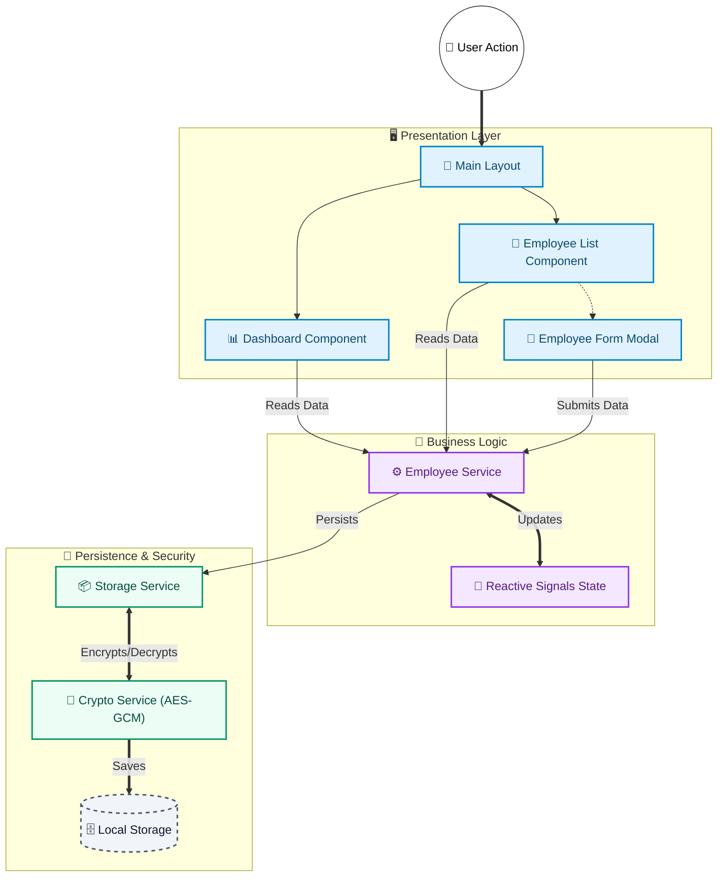

# Employee Management System

> **Enterprise-Grade Workforce Administration Platform**
> 
> *Precision-engineered for performance, security, and scalability.*

[](https://angular.io/)
[](https://www.typescriptlang.org/)
[](https://vitejs.dev/)
[]()
[]()
[](https://employee-dashboard-ivory.vercel.app/)

---

## 🏛️ Executive Summary

The **Employee Management System** is a sophisticated Single Page Application (SPA) architected to deliver a seamless workforce management experience. Built upon the robust **Angular** framework and powered by **Vite**, it represents a shift from legacy administration tools to a modern, reactive, and visually immersive interface.

The system prioritizes **Data Integrity** and **Security**, utilizing banking-grade encryption standards for client-side data persistence, ensuring that sensitive organizational data remains protected at rest.

### 🌟 Key Differentiators
-   **Reactive Core**: Leverages Angular **Signals** for fine-grained reactivity, eliminating unnecessary change detection cycles.
-   **Zero-Knowledge Persistence**: Implements **AES-GCM 256-bit encryption** for storage using the Web Crypto API.
-   **Glassmorphism UI**: A custom-designed aesthetic that combines blurred backdrops with high-contrast typography for a premium feel.
-   **Lazy Loaded Modules**: Optimized bundle sizes via route-level code splitting.

> [!TIP]
> **🚀 Try it live!** The system is already deployed and ready to explore.  
> **👉 [Visit the Live Demo on Vercel](https://employee-dashboard-ivory.vercel.app/)**  
> No installation required—experience the full application instantly in your browser.

---

## 🏗️ System Architecture

The application follows a strict **Feature-Based Modular Architecture**. This design pattern ensures separation of concerns, maintainability, and scalability.



---

## 📂 Codebase Structure

The project directory is organized to facilitate scalability and team collaboration.

```plaintext
src/
├── app/
│   ├── core/                 # 🧠 SINGLETONS & BUSINESS LOGIC
│   │   ├── models/           #    - Data interfaces & Enums (Strict Typing)
│   │   ├── services/         #    - EmployeeService, StorageService, CryptoService
│   │   └── validators/       #    - Custom form validators (Regex patterns)
│   │
│   ├── features/             # 📦 SMART COMPONENTS (Lazy Loaded)
│   │   ├── dashboard/        #    - KPI visualization & Analyitcs
│   │   ├── employee-list/    #    - Grids, Filtering Logic, CSV Export
│   │   └── employee-form/    #    - Forms & Validation Logic
│   │
│   ├── layout/               # 📐 UI SKELETON
│   │   ├── main-layout/      #    - Wrapper for RouterOutlet
│   │   ├── sidebar/          #    - Navigation logic
│   │   └── header/           #    - Global search & User profile
│   │
│   ├── shared/               # 🧩 REUSABLE UI
│   │   ├── components/       #    - Generic UI (Modal, Badge, Loader)
│   │   └── pipes/            #    - Data transformers
│   │
│   ├── app.routes.ts         # 🛣️ Routing Logic (Lazy Loading Config)
│   └── app.config.ts         # ⚡ DI Configuration (Providers)
│
├── assets/                   # 🎨 STATIC RESOURCES (Images, Icons)
├── styles/                   # 💅 GLOBAL STYLING (SCSS Variables, Mixins)
└── index.html                # 🌐 Entry Point
```

---

## 🔐 Security & Encryption

We adhere to a **Security-First** approach.

### 🛡️ AES-GCM 256-bit Encryption
We utilize the **Web Crypto API** to implement **AES-GCM (Galois/Counter Mode)**, the gold standard for authenticated encryption.
-   **Authenticated Encryption:** Guarantees both confidentiality (data is hidden) and integrity (data hasn't been tampered with).
-   **Unique Keys:** Encryption keys are derived using **PBKDF2** with **100,000 iterations**, combining a secret, the user agent, and a unique salt per browser instance.
-   **Random IVs:** Every single encryption operation uses a fresh, random Initialization Vector (IV), preventing pattern analysis.

### ⚠️ Why Not Traditional LocalStorage?
Traditional `localStorage` stores data as **plain text**, which poses significant security risks:

| Risk | Description |
|:---|:---|
| **XSS Vulnerability** | Any malicious script injected via XSS can read all localStorage data instantly. |
| **Browser Extension Access** | Extensions with storage permissions can silently harvest sensitive employee data. |
| **Physical Device Access** | Anyone with access to the device can open DevTools and view all stored information. |
| **No Data Integrity** | Plain localStorage has no mechanism to detect if data has been tampered with. |

> [!CAUTION]
> Employee data (names, salaries, contact info) is **Personally Identifiable Information (PII)**. Storing it in plain text—even client-side—violates security best practices and can lead to compliance issues.

By implementing **AES-GCM encryption**, even if an attacker gains access to localStorage, they see only **unreadable ciphertext**—rendering the data useless without the derived key.

### 💾 Secure LocalStorage
Data persistence is handled by a custom `StorageService` that wraps the browser's LocalStorage with an encryption layer.
-   **Zero-Knowledge Storage:** Data saved to `localStorage` is **fully ciphertext**.
-   **Automatic Decryption:** The application transparently decrypts data on retrieval, providing a seamless user experience without compromising security.

---

## 📸 Visual Showcase

Experience the dual-themed interface designed for clarity and aesthetics.

### 📊 Dashboard Overview
The command center of the application. Visualizes key workforce metrics with real-time stats and smooth animations.

| **Dark Mode** | **Light Mode** |
|:---:|:---:|
|  |  |

### 👥 Global Workforce List
A powerful, high-density data table with advanced filtering and search capabilities.

| **Dark Mode** | **Light Mode** |
|:---:|:---:|
|  |  |

### ⚡ Seamless Actions
Intuitive modals and forms for managing employee data without losing context.

| **Add Employee** | **Edit Details** | **Delete Confirmation** |
|:---:|:---:|:---:|
|  |  |  |

> *All interactions feature glassmorphism backdrops and micro-interactions for a premium feel.*

---

## 🚀 Getting Started

### Prerequisites
-   **Node.js**: v18.0.0+
-   **npm**: v10.0.0+

### Installation & Execution

1.  **Clone the Architecture**
    ```bash
    git clone https://github.com/MehtabRosul/Employee-Dashboard.git
    cd Employee-Dashboard
    ```

2.  **Hydrate Dependencies**
    ```bash
    npm install
    ```

3.  **Launch Development Server**
    ```bash
    npm run start
    ```
    *Access the application at `http://localhost:4200/`*

4.  **Production Build**
    ```bash
    npm run build
    ```
    *Compiles optimized, minified assets to `dist/`.*

---

## 🧪 Quality Assurance

We maintain code quality through rigorous testing.

```bash
# Execute Unit Tests (Vitest)
npm run test
```

---

## 🧩 Problem-Solving Approach

This project was engineered with a focus on demonstrating mastery across core frontend development competencies.

---

### 🅰️ Angular Knowledge

**Components, Modules, Services, Signals & Forms** — The application showcases deep Angular expertise:

| Concept | Implementation |
|:---|:---|
| **Standalone Components** | Every component uses the modern `standalone: true` pattern, eliminating NgModule boilerplate. |
| **Feature Modules** | Dashboard, Employee List, and Employee Form are self-contained feature units with lazy loading. |
| **Services & DI** | `EmployeeService`, `StorageService`, and `CryptoService` are injected via Angular's dependency injection system. |
| **Reactive Forms** | The employee form uses `FormBuilder` with custom validators for name patterns, email format, and date constraints. |
| **Angular Signals** | All state management uses `signal()`, `computed()`, and `effect()` for fine-grained reactivity without RxJS complexity. |
| **Two-Way Binding** | Search and filter controls leverage `[(ngModel)]` with debounced inputs for real-time feedback. |

---

### 🟨 JavaScript Skills

**Array Methods, Sorting, Filtering & Validation** — Pure JavaScript mastery powers the data layer:

-   **Filtering**: `Array.filter()` dynamically filters employees by department, status, and gender based on user selections.
-   **Sorting**: `Array.sort()` with custom comparators handles ascending/descending sorts on name, salary, and join date.
-   **Searching**: Case-insensitive search using `String.toLowerCase()` and `includes()` across multiple employee fields.
-   **Mapping**: `Array.map()` transforms employee data for CSV export and dashboard aggregations.
-   **Reducing**: `Array.reduce()` calculates totals like average salary and department counts for KPI cards.
-   **Validation**: Custom regex patterns (`/^[A-Za-z\s]+$/` for names, email RFC 5322 patterns) ensure data integrity.

---

### 🧹 Code Quality

**Readability, Reusability & Modularity** — Production-grade code standards:

| Principle | How It's Applied |
|:---|:---|
| **Single Responsibility** | Each service handles one concern: `CryptoService` (encryption), `StorageService` (persistence), `EmployeeService` (business logic). |
| **DRY (Don't Repeat Yourself)** | Shared validators, pipes, and utility functions are centralized in the `core/` and `shared/` directories. |
| **Strict Typing** | TypeScript `interfaces` and `enums` (`Employee`, `EmployeeStatus`, `Department`) enforce type safety everywhere. |
| **Clean Imports** | Barrel exports (`index.ts`) in each module simplify import statements across the codebase. |
| **Consistent Naming** | Files follow Angular conventions: `*.component.ts`, `*.service.ts`, `*.pipe.ts`. |
| **No Console Logs** | All debug statements removed; production-ready codebase. |

---

### 🎨 UI/UX Design

**Responsiveness, User Experience & Attention to Detail** — A premium, polished interface:

-   **Glassmorphism Aesthetic**: Frosted glass effects with `backdrop-filter: blur()` create depth and visual hierarchy.
-   **Dual Theme Support**: Seamless dark/light mode toggle with CSS custom properties for instant switching.
-   **Micro-Animations**: Hover effects, button ripples, and modal transitions provide tactile feedback.
-   **Mobile-First Responsive**: Flexbox and CSS Grid layouts adapt flawlessly from 320px phones to 4K displays.
-   **Accessibility Considerations**: Proper contrast ratios, focus states, and semantic HTML structure.
-   **Empty States**: Friendly illustrations and CTAs when no employees exist, guiding users to add data.
-   **Loading States**: Skeleton loaders and spinners prevent jarring content shifts.

---

### 🧠 Problem Solving

**Persistence, Search, Validations & Edge Cases** — Thoughtful solutions to real requirements:

| Requirement | Solution |
|:---|:---|
| **Data Persistence** | Encrypted localStorage ensures data survives page refreshes and browser restarts. |
| **Real-Time Search** | Debounced search input with computed signals updates results instantly without API calls. |
| **Form Validations** | Multi-layer validation: required fields, pattern matching, date range constraints, and duplicate prevention. |
| **Bulk Operations** | CSV export with proper escaping handles special characters, commas, and newlines in data. |
| **State Sync** | Signals automatically propagate changes from forms to lists to dashboard KPIs in real-time. |
| **Error Handling** | Try-catch blocks with graceful fallbacks prevent crashes from corrupted storage data. |

---

### 📝 Employee Form — Validation & Logic

The Add/Edit Employee form implements **enterprise-grade validation** with triple-layer protection:

#### 🔒 Triple-Layer Validation Architecture

| Layer | Purpose | Implementation |
|:---|:---|:---|
| **1. Form Validators** | Real-time feedback | Custom Angular validators show errors as user types |
| **2. Submit Guard** | Pre-submission check | `onSubmit()` explicitly validates before emitting data |
| **3. Service Layer** | Final safety net | `EmployeeService` throws errors for invalid data |

#### ✅ Field Validation Rules

| Field | Validation Rules | Error Messages |
|:---|:---|:---|
| **Full Name** | Required, min 2 chars, letters/spaces only, **unique** | "Name already taken" |
| **Email** | Required, valid format, **unique** | "Email already in use" |
| **Department** | Required, must select from dropdown | "Department is required" |
| **Date of Joining** | Required, cannot be future date | "Date cannot be in the future" |
| **Gender** | Required, must select | "Gender is required" |
| **Age** | Required, **18-59 years only** | "Minimum age is 18 years" / "Maximum age is 59 years" |
| **Performance** | 0-100% range slider | N/A (slider enforces range) |

#### ⚡ Async Validation (Real-Time Uniqueness Check)

-   **Debounced Requests**: 500ms debounce prevents excessive checks on every keystroke
-   **"Checking availability..."**: Visual feedback while async validators run
-   **Prevents Submit**: Button disabled while validation is pending
-   **Case-Insensitive**: "John Doe" and "john doe" are treated as duplicates

#### 🛡️ Age Validation Deep Dive

```typescript
// Custom age validator with explicit range check
export function ageValidator(): ValidatorFn {
    return (control) => {
        const value = Number(control.value);
        if (value < 18) return { ageTooYoung: true };
        if (value > 59) return { ageTooOld: true };
        return null;
    };
}
```

**Why 18-59?** This represents the legal working age range, ensuring compliance with labor regulations.

---

### 🔐 Crypto Encryption

**Why AES-GCM Over Plain LocalStorage?** — Security as a first-class citizen:

Employee data contains **Personally Identifiable Information (PII)**: names, emails, salaries, and contact details. Storing this in plain `localStorage` would be a critical vulnerability.

**Our Implementation:**
-   **Algorithm**: AES-GCM 256-bit via the native **Web Crypto API** (no external libraries).
-   **Key Derivation**: PBKDF2 with **100,000 iterations**, combining a secret, user agent, and unique salt.
-   **Random IVs**: Every encryption uses a fresh Initialization Vector, preventing pattern analysis.
-   **Authenticated Encryption**: AES-GCM provides both confidentiality AND integrity verification.

**Result**: Even if an attacker accesses localStorage via XSS or DevTools, they see only **unreadable ciphertext**—the data is useless without the derived key.

---

### 📐 Architectural Decisions

1.  **Feature-Based Modularity**: Each feature (Dashboard, Employee List, Form) is self-contained, promoting separation of concerns and testability.
2.  **Service Layer Abstraction**: All business logic resides in services (`EmployeeService`, `StorageService`, `CryptoService`), keeping components lean and presentation-focused.
3.  **Reactive State with Signals**: Moved away from RxJS observables for local state, embracing Angular Signals for simpler, more predictable reactivity.
4.  **Lazy Loading**: Route-level code splitting ensures users only download the code they need, reducing initial bundle size.

---

## 📄 License & Proprietary Rights

**© 2026 Employee Management System.**
Please visit $ view the dashboard and let me know your decision Thank-You.
