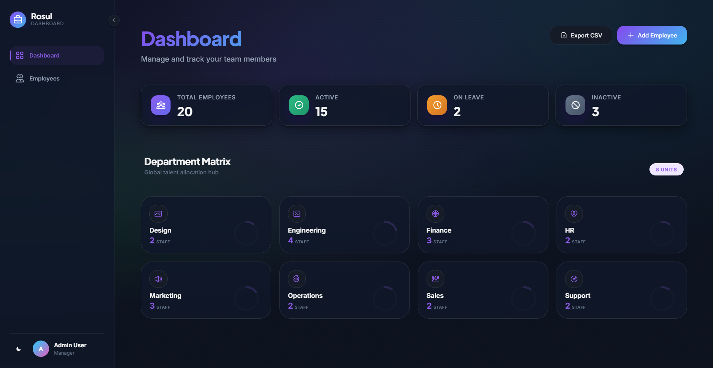
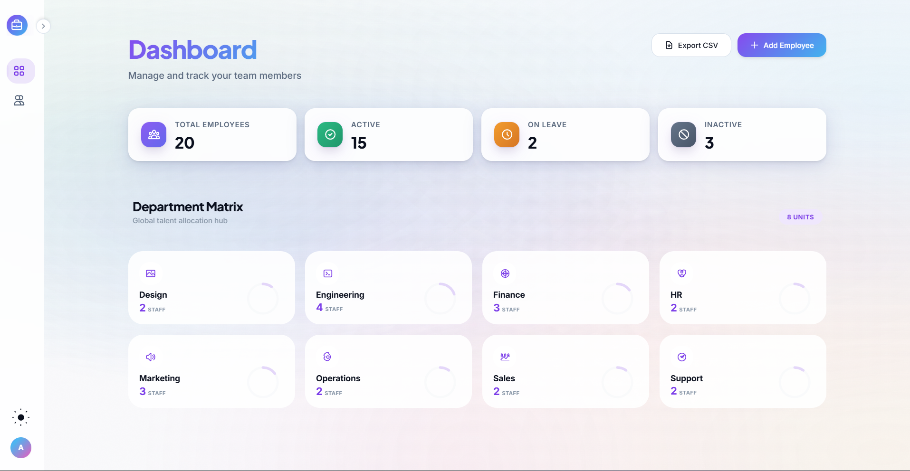
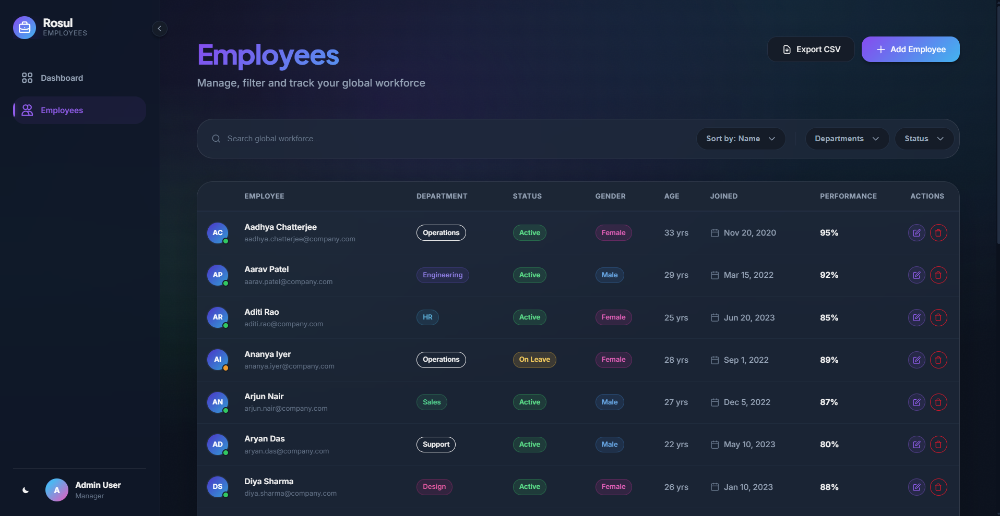
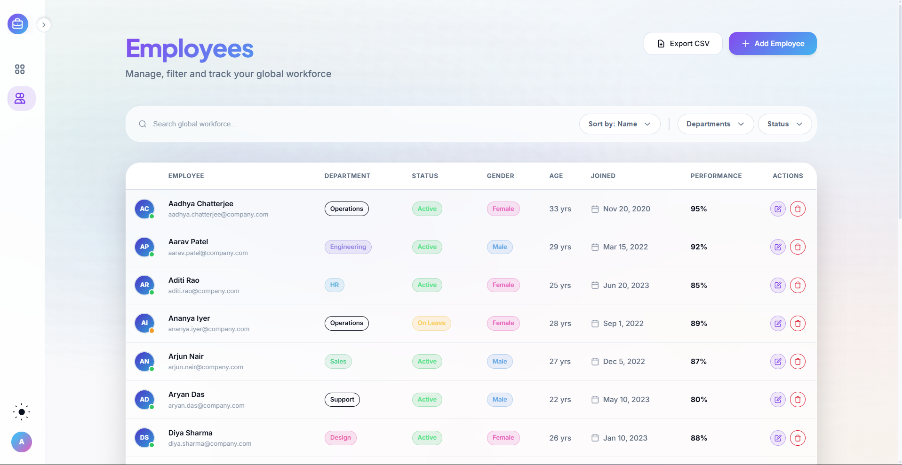
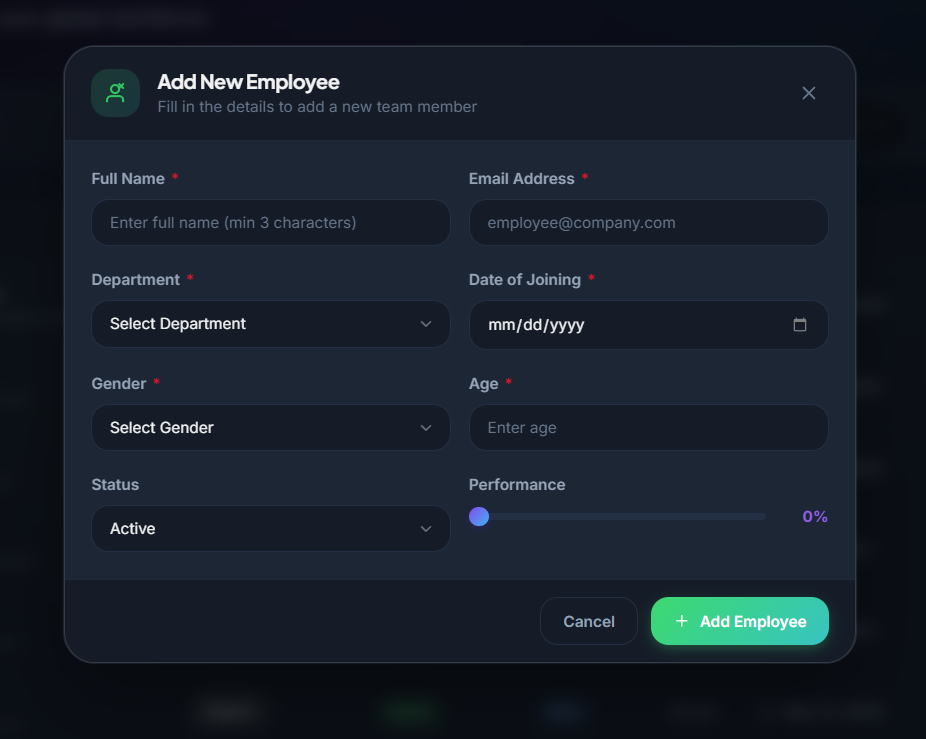
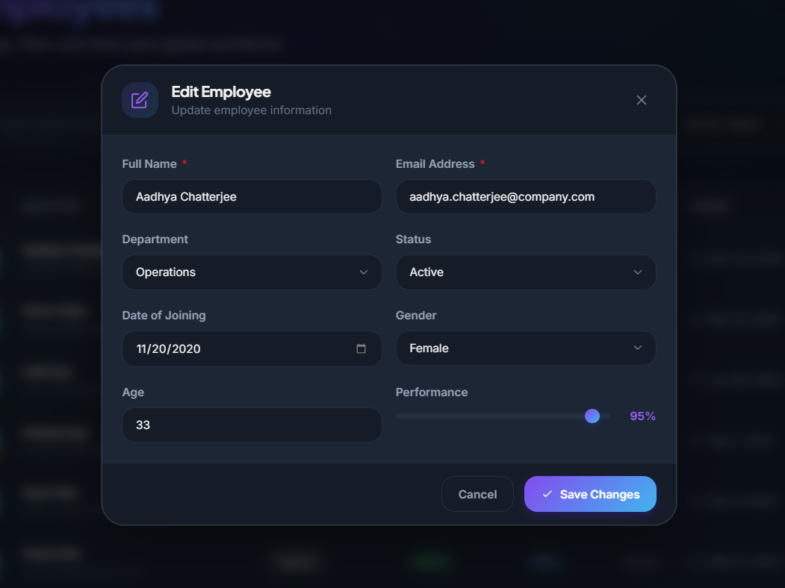
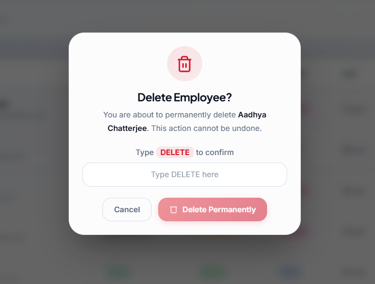

# Employee Dashboard

> A premium, high-performance employee management system built with **Angular 21** and modern web standards.

[](https://angular.io/)
[](https://www.typescriptlang.org/)
[](https://vitejs.dev/)
[]()

## � Live Demo

[**View Live Application**](https://employee-dashboard-ivory.vercel.app/employees)

## �📖 Overview

The **Employee Dashboard** is a state-of-the-art web application designed to manage global workforce data with a focus on **User Experience (UX)** and **Visual Aesthetics**. It transitions away from traditional, clunky admin panels to a sleek, **glassmorphism-inspired** interface that is both functional and beautiful.

Key highlights include:
- **Reactive State Management:** Powered by Angular Signals for granular reactivity and high performance.
- **Modern UI/UX:** A custom-built design system featuring glassmorphism, smooth transitions, and a premium dark-themed color palette.
- **Responsive Design:** Fully adaptive layouts that work seamlessly across high-resolution desktops, laptops, and mobile devices.
- **Performance First:** Optimized build with Vite and lightweight standalone components.

---

## 📸 Visual Showcase

Experience the dual-themed interface designed for clarity and aesthetics.

### 📊 Dashboard Overview
The command center of the application. Visualizes key workforce metrics with real-time stats and smooth animations.

| **Dark Mode** | **Light Mode** |
|:---:|:---:|
|  |  |

---

### 👥 Global Workforce List
A powerful, high-density data table with advanced filtering and search capabilities.

| **Dark Mode** | **Light Mode** |
|:---:|:---:|
|  |  |

---

### ⚡ Seamless Actions
Intuitive modals and forms for managing employee data without losing context.

| **Add Employee** | **Edit Details** | **Delete Confirmation** |
|:---:|:---:|:---:|
|  |  |  |

> *All interactions feature glassmorphism backdrops and micro-interactions for a premium feel.*

---

## 🚀 Getting Started

Follow these steps to set up the project locally on your machine.

### Prerequisites
- **Node.js**: v18.0.0 or higher
- **npm**: v10.0.0 or higher

### Installation

1.  **Clone the repository**
    ```bash
    git clone https://github.com/yourusername/employee-dashboard.git
    cd employee-dashboard
    ```

2.  **Install dependencies**
    ```bash
    npm install
    # If you encounter dependency conflicts with the bleeding-edge Angular version:
    npm install --legacy-peer-deps
    ```

### Running the Application

1.  **Start the development server**
    ```bash
    npm run start
    ```
    The application will be available at `http://localhost:4200/`.

2.  **Build for production**
    ```bash
    npm run build
    ```
    The build artifacts will be stored in the `dist/` directory.

---

## 📂 Project Structure

The project follows a scalable, modular architecture designed for growth.

```plaintext
src/
├── app/
│   ├── core/                 # Singleton services, models, and guards
│   │   ├── models/           # TypeScript interfaces (e.g., Employee, Department)
│   │   └── services/         # State holding services (e.g., EmployeeService)
│   │
│   ├── features/             # Feature-based modules (Smart Components)
│   │   ├── dashboard/        # Dashboard stats and overview
│   │   └── employee-list/    # Employee management table & logic
│   │
│   ├── layout/               # Global layout components
│   │   └── main-layout/      # App shell (Sidebar, Header, Router Outlet)
│   │
│   ├── shared/               # Reusable UI components (buttons, badges)
│   ├── app.routes.ts         # Main application routing
│   └── app.config.ts         # Application providers and config
│
├── assets/                   # Static assets (images, icons)
├── styles/                   # Global SCSS partials and variables
└── index.html                # Application entry point
```

---

## 🛠️ Technical Architecture

### 1. State Management (Signals)
We utilize **Angular Signals** (`signal`, `computed`, `effect`) effectively replacing the need for complex libraries like NgRx for this scale.
-   **Service-based State:** `EmployeeService` holds the "source of truth" in a `writableSignal`.
-   **derived State:** Filtering and sorting are implemented using `computed` signals, ensuring the UI only updates when strictly necessary.

### 2. SCSS Architecture
The styling is built using a modular SCSS architecture.
-   **Variables:** Design tokens for colors, spacing, and typography are defined in CSS variables (`--color-primary`, `--space-4`) allowing for easy theming.
-   **Glassmorphism:** A dedicated set of classes creates the signature frosted glass effect (`backdrop-filter: blur()`).

### 3. Component Design
-   **Standalone Components:** All components are standalone, reducing module boilerplate.
-   **Smart vs. Dumb:**
    -   *Smart Components* (e.g., `EmployeeList`) handle data fetching and state.
    -   *Dumb Components* (e.g., `Badge`, `Avatar`) are purely presentational.

---

## 🎨 Design System

The application uses a "Cyber-Dark" aesthetic designed for high-end professional tools.

| Color | Hex | Usage |
| :--- | :--- | :--- |
| **Primary** | `#7C3AED` | Primary actions, gradients, active states |
| **Surface** | `#1E293B` | Base background color |
| **Glass** | `rgba(30, 41, 59, 0.7)` | Panels and overlays |
| **Text** | `#F8FAFC` | High-emphasis text |

---

## 🧪 Testing

We use **Vitest** for unit testing, offering a faster and more modern alternative to Karma.

```bash
# Run unit tests
npm run test
```

---

## 🤝 Contributing

1.  Fork the repository.
2.  Create your feature branch (`git checkout -b feature/amazing-feature`).
3.  Commit your changes (`git commit -m 'Add some amazing feature'`).
4.  Push to the branch (`git push origin feature/amazing-feature`).
5.  Open a Pull Request.

---

## 📄 License

This project is proprietary and confidential. Unauthorized copying of this file, via any medium is strictly prohibited.
